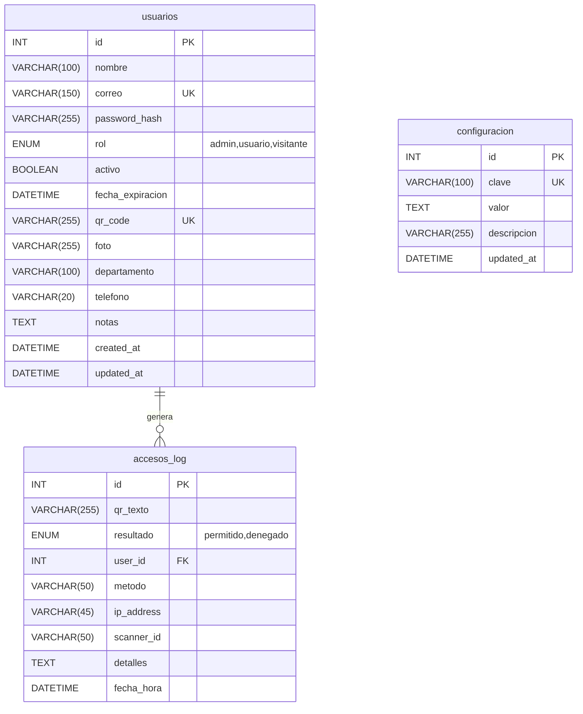

# 🔐 QR Access Control PRO — Análisis Exhaustivo de Arquitectura

**Proyecto:** `QR_Access_PROPC`
**Fecha de análisis:** 27 de marzo de 2026
**Analista:** Arquitecto de Software AI

---

## 1. Arquitectura y Estructura de Carpetas

### 1.1 Árbol Visual del Proyecto

```
QR_Access_PROPC/
├── .env                         # Variables de entorno (producción local)
├── .env.example                 # Plantilla de configuración (118 vars)
├── .gitignore                   # Exclusiones de Git
├── .github/                     # Configuración de GitHub
├── .vscode/                     # Configuración del IDE
├── CHANGELOG.md                 # Historial de cambios
├── CONTRIBUTING.md              # Guía de contribución
├── Dockerfile                   # Imagen Docker (Python 3.11-slim)
├── docker-compose.yml           # Stack completo (web + mysql + redis + nginx)
├── nginx.conf                   # Proxy reverso con SSL/TLS, rate limiting
├── pytest.ini                   # Configuración de pytest con markers
├── requirements.txt             # 22 dependencias Python
├── README.md                    # Documentación principal
├── QUICKSTART.md                # Guía de inicio rápido
├── start.ps1                    # Script de inicio (Windows/PowerShell)
├── stop.ps1                     # Script de detención (Windows/PowerShell)
├── test_auth.py                 # Test de autenticación (raíz)
├── test_login.py                # Test de login (raíz)
│
├── config/                      # ⚙️ Configuración centralizada
│   ├── __init__.py
│   ├── database.py              # Pool de conexiones MySQL
│   ├── logging_config.py        # Logging estructurado (structlog + rotating files)
│   └── settings.py              # Clase Config con carga de .env
│
├── database/                    # 🗄️ Esquemas SQL
│   ├── setup_database.sql       # Schema base (3 tablas core)
│   ├── schema_extensions.sql    # Extensiones (+7 tablas, RBAC, turnos, tokens)
│   └── add_indexes.sql          # Índices de rendimiento
│
├── web_panel/                   # 🌐 Aplicación Flask principal
│   ├── __init__.py
│   ├── app.py                   # Entry point + Application Factory
│   ├── models/                  # 📊 Capa de datos (DAL)
│   │   ├── __init__.py
│   │   ├── user.py              # CRUD usuarios + autenticación
│   │   ├── access_log.py        # Logs de acceso + estadísticas
│   │   ├── zone.py              # Multi-zona RBAC
│   │   └── payroll.py           # Turnos, jornadas, nómina
│   ├── routes/                  # 🛣️ Rutas/Controladores
│   │   ├── __init__.py
│   │   ├── auth.py              # Login, registro, logout
│   │   ├── dashboard.py         # Panel principal + Mi QR
│   │   ├── admin.py             # CRUD admin, reportes, gestión QR
│   │   ├── api.py               # Endpoints JSON (stats, validación, live)
│   │   └── scanner.py           # Terminal web de escaneo
│   ├── services/                # 🔧 Lógica de negocio
│   │   ├── __init__.py
│   │   ├── qr_service.py        # Generación de imágenes QR
│   │   ├── totp_service.py      # TOTP (QR dinámico, RFC 6238)
│   │   ├── email_service.py     # Envío de QR por email (HTML + CID)
│   │   ├── email_confirmation_service.py  # Confirmación email + reset password
│   │   ├── export_service.py    # Exportar reportes (PDF/Excel/Word)
│   │   ├── audit_service.py     # Auditoría de acciones admin
│   │   └── cache_service.py     # Caché Redis (degradación elegante)
│   ├── utils/                   # 🛡️ Utilidades
│   │   ├── __init__.py
│   │   └── decorators.py        # @login_required, @admin_required, @role_required, @require_api_key
│   ├── static/                  # 📁 Archivos estáticos
│   │   ├── css/style.css        # (26 KB) Estilos con glassmorphism
│   │   ├── js/main.js           # (9.5 KB) Lógica frontend
│   │   └── qrcodes/             # Imágenes QR generadas
│   └── templates/               # 🖼️ Templates Jinja2
│       ├── base.html            # Layout base
│       ├── login.html           # Página de login
│       ├── register.html        # Registro público
│       ├── panel.html           # Dashboard con gráficos
│       ├── mi_qr.html           # Vista del QR personal
│       ├── scanner.html         # Terminal de escaneo web
│       └── admin_usuarios.html  # Gestión de usuarios
│
├── scanner/                     # 📷 Módulo de cámara física
│   └── scanner_fisico.py        # OpenCV + pyzbar (lectura cámara)
│
├── scripts/                     # 🔨 Scripts de mantenimiento
│   ├── setup.py                 # Setup completo del entorno
│   ├── init_database.py         # Inicialización de BD
│   ├── health_check.py          # Verificación de salud del sistema
│   ├── check_schema.py          # Verificación del esquema
│   ├── reset_admin.py           # Reset de usuario admin
│   └── replace_emojis.py        # Reemplazo de emojis por SVG
│
├── tests/                       # 🧪 Suite de pruebas
│   ├── __init__.py
│   ├── conftest.py              # Fixtures de pytest
│   ├── test_models.py           # Tests de modelos (311 líneas)
│   └── test_routes.py           # Tests de rutas (260 líneas)
│
├── docs/                        # 📚 Documentación
│   ├── ABOUT.md
│   ├── MANUAL_USUARIO.md
│   ├── PROYECCIONES.md
│   └── README_OLD.md
│
├── logs/                        # 📜 Archivos de log
│   └── web_panel.log            # Log del panel web (~95 KB)
│
└── backups/                     # 💾 Directorio de backups (vacío)
```

### 1.2 Patrón Arquitectónico

El proyecto sigue un patrón **MVC simplificado** (Model-View-Controller) adaptado al estilo Flask:

| Capa | Directorio | Responsabilidad |
|:---|:---|:---|
| **Model** | `web_panel/models/` | Acceso a datos via SQL crudo con `execute_query()` |
| **View** | `web_panel/templates/` | Templates Jinja2 (HTML) |
| **Controller** | `web_panel/routes/` | Blueprints de Flask (enrutamiento + lógica) |
| **Service** | `web_panel/services/` | Lógica de negocio desacoplada |
| **Config** | `config/` | Configuración centralizada |

> [!NOTE]
> No se usa un ORM. La capa de datos opera con **SQL crudo parametrizado** a través de `mysql.connector`, usando un pool de conexiones gestionado manualmente en `config/database.py`. Esto reduce la abstracción pero mantiene control total sobre queries y rendimiento.

---

## 2. Dependencias y Paquetes

### 2.1 Clasificación de Dependencias (`requirements.txt`)

#### Producción — Core
| Paquete | Versión | Propósito |
|:---|:---|:---|
| `Flask` | 3.1.0 | Framework web principal |
| `flask-mail` | 0.10.0 | Envío de emails |
| `Flask-Limiter` | 3.9.0 | Rate limiting por IP |
| `mysql-connector-python` | 9.1.0 | Driver MySQL (puro Python) |
| `python-dotenv` | 1.0.1 | Carga de variables `.env` |
| `cryptography` | 44.0.0 | Utilidades criptográficas |
| `requests` | 2.32.3 | Cliente HTTP |

#### Producción — QR & Scanner
| Paquete | Versión | Propósito |
|:---|:---|:---|
| `qrcode[pil]` | 8.0 | Generación de códigos QR |
| `opencv-python` | 4.10.0.84 | Captura de cámara + procesamiento |
| `pyzbar` | 0.1.9 | Decodificación de QR desde imagen |
| `pyotp` | 2.9.0 | TOTP (QR dinámico, RFC 6238) |
| `pillow` | 11.0.0 | Manipulación de imágenes |
| `numpy` | 2.1.3 | Arrays numéricos (dependencia OpenCV) |

#### Producción — Exportación & Caché
| Paquete | Versión | Propósito |
|:---|:---|:---|
| `fpdf` | 1.7.2 | Generación de PDF |
| `python-docx` | 1.1.2 | Generación de Word (.docx) |
| `openpyxl` | 3.1.5 | Generación de Excel (.xlsx) |
| `redis` | 5.0.1 | Caché Redis |
| `structlog` | 24.1.0 | Logging estructurado JSON |
| `python-dateutil` | 2.8.2 | Utilidades de fechas |
| `email-validator` | 2.2.0 | Validación de emails |

#### Desarrollo / Testing
| Paquete | Versión | Propósito |
|:---|:---|:---|
| `pytest` | 8.3.3 | Framework de testing |
| `pytest-flask` | 1.3.0 | Integración pytest + Flask |

### 2.2 Observaciones sobre Dependencias

> [!WARNING]
> **flask-mail** (v0.10.0) es un paquete **abandonado** (último release en 2014). Se recomienda migrar a **Flask-Mailman** (que es un wrapper activo de `django.core.mail` para Flask) o a la alternativa moderna **flask-mail-sendgrid**.

> [!IMPORTANT]
> **fpdf** (v1.7.2) también está obsoleta. La versión moderna es **fpdf2** (`pip install fpdf2`) que tiene soporte Unicode nativo, lo cual es importante para caracteres en español (ñ, acentos).

- `opencv-python` solo se necesita en el módulo del escáner físico. Podría ser una **dependencia opcional** para despliegues que solo usen el panel web.
- `gunicorn` (mencionado en `Dockerfile` y `docker-compose.yml`) **no está en `requirements.txt`**. Falla en producción al intentar usar Docker.
- `werkzeug` no aparece explícitamente pero se instala como dependencia de Flask. Se usa directamente para hashing de passwords.

---

## 3. Base de Datos y Modelado de Datos

### 3.1 Motor de Base de Datos

| Aspecto | Valor |
|:---|:---|
| **Motor** | MySQL 8.0+ |
| **Puerto local** | 3307 (personalizado) |
| **Charset** | utf8mb4 / utf8mb4_unicode_ci |
| **Engine** | InnoDB (transaccional) |
| **Pool** | `mysql.connector.pooling` (5 conexiones) |
| **Docker** | `mysql:8.0-alpine` |

### 3.2 Esquema de Tablas

#### Esquema Base (`setup_database.sql`) — 3 tablas



#### Extensiones (`schema_extensions.sql`) — +7 tablas/alteraciones

| Tabla/Alteración | Propósito |
|:---|:---|
| `usuarios` +3 cols | `email_confirmado`, `email_token`, `totp_secret` |
| **`admin_logs`** | Auditoría de acciones admin (JSON `cambios`) |
| **`zonas`** | Zonas de acceso multi-RBAC |
| **`usuario_zona_permisos`** | Asignación usuario↔zona con permisos |
| **`turnos`** | Horarios de entrada/salida esperados |
| **`jornadas`** | Registro real de horas trabajadas y atrasos |
| **`password_reset_tokens`** | Tokens de recuperación de contraseña |
| `accesos_log` +4 cols | Geocoordenadas (`latitud`, `longitud`, `ciudad`, `pais`) |

### 3.3 Índices de Rendimiento

El proyecto define índices explícitos en 3 archivos SQL:

- `idx_correo`, `idx_qr_code`, `idx_rol`, `idx_activo` → en `usuarios`
- `idx_fecha_hora`, `idx_resultado`, `idx_user_id` → en `accesos_log`
- `idx_user_fecha`, `idx_resultado_fecha`, `idx_email_activo` → compuestos para queries frecuentes
- Índices en todas las FK de tablas extendidas

### 3.4 Gestión de Migraciones

> [!CAUTION]
> **No existe un sistema de migraciones automatizado.** Los cambios de esquema se gestionan con archivos SQL manuales (`setup_database.sql` + `schema_extensions.sql`). No hay versionado, rollback ni tracking de qué migraciones se han aplicado. En un entorno de producción real, esto es un riesgo significativo.
>
> Se recomienda implementar **Alembic** (para SQLAlchemy) o un gestor de migraciones manual como **yoyo-migrations** o **dbmate**.

---

## 4. Funciones, Clases y Módulos Clave

### 4.1 Entry Point

- **Archivo:** [app.py](file:///d:/Proyectos/actuales/QR_Access_PROPC/web_panel/app.py)
- **Función principal:** `create_app()` (Application Factory Pattern)
- **Responsabilidades:**
  - Configurar Flask (secret_key, session, mail, upload limits)
  - Registrar 5 Blueprints (`auth`, `dashboard`, `admin`, `api`, `scanner`)
  - Configurar logging (rotating file + console)
  - Crear usuario admin por defecto (`admin@qraccess.com / admin123`)
  - Error handlers (404 → redirect, 500 → página de error)

---

### 4.2 Modelos (Data Access Layer)

#### [user.py](file:///d:/Proyectos/actuales/QR_Access_PROPC/web_panel/models/user.py) — 170 líneas
| Función | Tipo | Descripción |
|:---|:---|:---|
| `hash_password()` | Utilidad | Werkzeug scrypt hashing |
| `verify_password()` | Utilidad | Verificación contra hash |
| `create_user()` | CRUD | Inserta usuario + genera `qr_code` con `secrets.token_urlsafe(32)` |
| `authenticate()` | Auth | Login: email + password + verificación activo |
| `get_all()` | Query | Lista filtrable (search, rol, activo) |
| `update_user()` | CRUD | Update dinámico (solo campos proporcionados) |
| `toggle_active()` | CRUD | Activar/desactivar usuario |
| `regenerate_qr()` | CRUD | Nuevo token QR |
| `count_users()` / `count_active_users()` | Stats | Contadores |

#### [access_log.py](file:///d:/Proyectos/actuales/QR_Access_PROPC/web_panel/models/access_log.py) — 140 líneas
| Función | Descripción |
|:---|:---|
| `create_log()` | Registrar intento de acceso |
| `get_recent()` | Últimos N accesos con JOIN a usuarios |
| `get_stats_today()` | Estadísticas del día (total, permitidos, denegados) |
| `get_stats_week()` | Tendencia semanal con relleno de días vacíos |
| `get_stats_by_hour_today()` | Desglose por hora |
| `get_all_filtered()` | Consulta avanzada con 5 filtros |

#### [zone.py](file:///d:/Proyectos/actuales/QR_Access_PROPC/web_panel/models/zone.py) — 182 líneas
Gestión multi-zona con RBAC: `create_zone`, `assign_user_to_zone`, `can_user_access_zone`, `log_zone_access`, `get_zone_access_stats`, `bulk_assign_users_to_zone`.

#### [payroll.py](file:///d:/Proyectos/actuales/QR_Access_PROPC/web_panel/models/payroll.py) — 226 líneas
Módulo de nómina: `create_shift`, `create_jornada`, `calculate_jornada_hours` (cálculo de horas trabajadas y atrasos), `get_payroll_report`, `export_payroll_csv`.

---

### 4.3 Rutas/Controladores (5 Blueprints)

#### [auth.py](file:///d:/Proyectos/actuales/QR_Access_PROPC/web_panel/routes/auth.py) — Blueprint `auth`
| Ruta | Método | Decoradores | Descripción |
|:---|:---|:---|:---|
| `/login` | GET/POST | `@limiter.limit("10/min")` | Autenticación con rate limiting |
| `/register` | GET/POST | `@limiter.limit("5/min")` | Registro público (rol `usuario` forzado) |
| `/logout` | GET | — | Cierre de sesión |

#### [dashboard.py](file:///d:/Proyectos/actuales/QR_Access_PROPC/web_panel/routes/dashboard.py) — Blueprint `dashboard`
| Ruta | Decoradores | Descripción |
|:---|:---|:---|
| `/` | `@login_required` | Panel con stats (admin) o redirect a Mi QR (usuario) |
| `/mi-qr` | `@login_required` | Vista del QR personal + historial |
| `/mi-qr/regenerar` | `@login_required` | Regenerar QR (cooldown 5 min) + envío por email |

#### [admin.py](file:///d:/Proyectos/actuales/QR_Access_PROPC/web_panel/routes/admin.py) — Blueprint `admin` (`/admin`)
| Ruta | Método | Descripción |
|:---|:---|:---|
| `/usuarios` | GET | Listado filtrable de usuarios |
| `/usuarios/crear` | POST | Crear usuario |
| `/usuarios/<id>/editar` | POST | Editar usuario |
| `/usuarios/<id>/toggle` | POST | Activar/desactivar |
| `/usuarios/<id>/regenerar-qr` | POST | Regenerar QR + email |
| `/usuarios/<id>/eliminar` | POST | Eliminar (protege auto-eliminación) |
| `/usuarios/<id>/qr` | GET | Ver/descargar imagen QR |
| `/reportes/accesos` | GET | Exportar reportes (PDF/Excel/Word) |

#### [api.py](file:///d:/Proyectos/actuales/QR_Access_PROPC/web_panel/routes/api.py) — Blueprint `api` (`/api`)
| Ruta | Método | Auth | Descripción |
|:---|:---|:---|:---|
| `/stats` | GET | Session | Estadísticas del dashboard (JSON) |
| `/accesos` | GET | Session | Logs recientes (JSON) |
| `/accesos/live` | GET | Session | Actualización en tiempo real |
| `/accesos/filter` | POST | Session | Filtrado avanzado |
| `/validate_qr` | POST | **Público** | Validación QR externa (para scanners) |

#### [scanner.py](file:///d:/Proyectos/actuales/QR_Access_PROPC/web_panel/routes/scanner.py) — Blueprint `scanner` (`/scanner`)
| Ruta | Decoradores | Descripción |
|:---|:---|:---|
| `/` | `@role_required('admin','guardia')` | Terminal web de escaneo |
| `/validate` | `@require_api_key` | Validación QR vía API (header `X-API-Key`) |

---

### 4.4 Servicios (Lógica de Negocio)

| Servicio | Archivo | Líneas | Rol |
|:---|:---|:---|:---|
| **QR Service** | [qr_service.py](file:///d:/Proyectos/actuales/QR_Access_PROPC/web_panel/services/qr_service.py) | 58 | Generar/eliminar imágenes QR (qrcode lib) |
| **TOTP Service** | [totp_service.py](file:///d:/Proyectos/actuales/QR_Access_PROPC/web_panel/services/totp_service.py) | 98 | QR dinámico con TOTP (PyOTP, RFC 6238) |
| **Email Service** | [email_service.py](file:///d:/Proyectos/actuales/QR_Access_PROPC/web_panel/services/email_service.py) | 165 | Envío de QR por email (HTML profesional con CID inline) |
| **Email Confirm** | [email_confirmation_service.py](file:///d:/Proyectos/actuales/QR_Access_PROPC/web_panel/services/email_confirmation_service.py) | 196 | Confirmación email + reset password + cleanup tokens |
| **Export Service** | [export_service.py](file:///d:/Proyectos/actuales/QR_Access_PROPC/web_panel/services/export_service.py) | 179 | Reportes en PDF (fpdf), Excel (openpyxl), Word (python-docx) |
| **Audit Service** | [audit_service.py](file:///d:/Proyectos/actuales/QR_Access_PROPC/web_panel/services/audit_service.py) | 138 | Log de acciones admin en tabla `admin_logs` |
| **Cache Service** | [cache_service.py](file:///d:/Proyectos/actuales/QR_Access_PROPC/web_panel/services/cache_service.py) | 141 | Redis con degradación elegante (funciona sin Redis) |

### 4.5 Decoradores y Utilidades

[decorators.py](file:///d:/Proyectos/actuales/QR_Access_PROPC/web_panel/utils/decorators.py) — 84 líneas:
- `@login_required` — Requiere sesión activa
- `@admin_required` — Requiere rol `admin`
- `@role_required(*roles)` — Requiere uno de los roles especificados
- `@require_api_key` — Requiere header `X-API-Key` (para comunicación inter-módulo)
- `@ajax_required` — Requiere header `X-Requested-With: XMLHttpRequest`

### 4.6 Módulo del Scanner Físico

[scanner_fisico.py](file:///d:/Proyectos/actuales/QR_Access_PROPC/scanner/scanner_fisico.py) — 187 líneas:
- Loop principal con OpenCV `VideoCapture`
- Decodificación QR con `pyzbar.decode()`
- Overlay visual con estado (verde=permitido, rojo=denegado)
- Cooldown de 3 segundos entre lecturas del mismo QR
- Capturas de pantalla con tecla `s`

---

## 5. Scripts y Automatización

### 5.1 Scripts PowerShell (Windows)

| Script | Descripción |
|:---|:---|
| [start.ps1](file:///d:/Proyectos/actuales/QR_Access_PROPC/start.ps1) | Activa venv + ejecuta `python web_panel/app.py` |
| [stop.ps1](file:///d:/Proyectos/actuales/QR_Access_PROPC/stop.ps1) | Termina procesos en puerto 5000 |

### 5.2 Scripts Python (`scripts/`)

| Script | Líneas | Descripción |
|:---|:---|:---|
| [setup.py](file:///d:/Proyectos/actuales/QR_Access_PROPC/scripts/setup.py) | 302 | Setup completo: verifica Python 3.11+, crea venv, instala deps, genera `.env`, crea directorios |
| [init_database.py](file:///d:/Proyectos/actuales/QR_Access_PROPC/scripts/init_database.py) | 134 | Crea BD + tablas core + configs por defecto |
| [health_check.py](file:///d:/Proyectos/actuales/QR_Access_PROPC/scripts/health_check.py) | 273 | Verifica: Python, venv, deps, estructura, DB, Redis, tests, static files |
| [check_schema.py](file:///d:/Proyectos/actuales/QR_Access_PROPC/scripts/check_schema.py) | ~40 | Verificación del esquema de BD |
| [reset_admin.py](file:///d:/Proyectos/actuales/QR_Access_PROPC/scripts/reset_admin.py) | ~60 | Resetear contraseña del admin |
| [replace_emojis.py](file:///d:/Proyectos/actuales/QR_Access_PROPC/scripts/replace_emojis.py) | ~600 | Reemplazo automático de emojis por iconos SVG en templates |

### 5.3 Docker

| Archivo | Comando | Descripción |
|:---|:---|:---|
| `Dockerfile` | `docker build .` | Python 3.11-slim, instala deps, expone 5000, Gunicorn 4 workers |
| `docker-compose.yml` | `docker-compose up` | 4 servicios: web, mysql, redis, nginx |
| `nginx.conf` | — | Proxy reverso con SSL, rate limiting por zona, gzip, cache de estáticos |

---

## 6. Configuración y Entorno

### 6.1 Gestión de Variables de Entorno

La configuración se centraliza en [config/settings.py](file:///d:/Proyectos/actuales/QR_Access_PROPC/config/settings.py) mediante una clase `Config` que carga del `.env` con `python-dotenv`:

```python
class Config:
    SECRET_KEY = os.getenv('FLASK_SECRET_KEY', 'dev-secret-key-change-me')
    DB_HOST    = os.getenv('DB_HOST', 'localhost')
    # ... etc
```

### 6.2 Variables Categorizadas (`.env.example` — 118 líneas)

| Categoría | Variables | Ejemplo |
|:---|:---|:---|
| **Database** | `DB_HOST`, `DB_PORT`, `DB_USER`, `DB_PASSWORD`, `DB_NAME` | `localhost:3306` |
| **Redis** | `REDIS_ENABLED`, `REDIS_HOST`, `REDIS_PORT` | `localhost:6379` |
| **Flask** | `FLASK_APP`, `FLASK_ENV`, `FLASK_DEBUG`, `SECRET_KEY` | — |
| **Seguridad** | `SESSION_TIMEOUT`, `SESSION_COOKIE_*` | 28800s / HttpOnly |
| **Email** | `MAIL_SERVER`, `MAIL_PORT`, `MAIL_USE_TLS`, `MAIL_USERNAME/PASSWORD` | Gmail SMTP |
| **QR** | `QR_ERROR_CORRECTION`, `QR_BOX_SIZE`, `TOTP_WINDOW` | HIGH / 10 / 1 |
| **Rate Limiting** | `LOGIN_RATE_LIMIT`, `API_RATE_LIMIT`, `GENERAL_RATE_LIMIT` | 10/min, 30/min |
| **Deployment** | `ENVIRONMENT`, `API_BASE_URL`, `ALLOWED_ORIGINS`, `WORKERS` | production / 4 |
| **Backup** | `BACKUP_ENABLED`, `BACKUP_TIME`, `BACKUP_RETENTION_DAYS` | true / 03:00 UTC |

### 6.3 Valores Hardcodeados Detectados

> [!WARNING]
> Se detectaron los siguientes valores hardcodeados que deberían ser variables de entorno:

| Archivo | Línea | Valor | Riesgo |
|:---|:---|:---|:---|
| `.env` | L6 | `FLASK_SECRET_KEY=qr_access_pro_super_secret...` | Secreto en repositorio (`.gitignore` lo excluye ✓) |
| `.env` | L24 | `MAIL_PASSWORD=xlziywxqytikznzn` | Credencial SMTP real en archivo local |
| `docker-compose.yml` | L37-40 | `MYSQL_ROOT_PASSWORD=root_complex_2026` | Passwords en docker-compose |
| `init_database.py` | L9-13 | `DB_USER='root'`, `DB_PASSWORD='admin'` | Credenciales hardcodeadas (no usa `.env`) |
| `app.py` | L139 | `password='admin123'` | Password del admin por defecto |
| `decorators.py` | L64 | `'default-scanner-secret-key-2026'` | API key por defecto hardcodeada |

---

## 7. Pruebas

### 7.1 Estructura de Tests

```
tests/
├── __init__.py
├── conftest.py          # 178 líneas — fixtures + markers + hooks
├── test_models.py       # 311 líneas — 16 tests (password, TOTP, cache, user CRUD)
└── test_routes.py       # 260 líneas — 14 tests (auth, dashboard, API, admin, seguridad)
```

**Archivos adicionales en raíz** (fuera de `tests/`):
- `test_auth.py` (903 bytes)
- `test_login.py` (481 bytes)

### 7.2 Framework y Configuración

- **Framework:** pytest 8.3.3 + pytest-flask 1.3.0
- **Configuración:** `pytest.ini` con strict markers y categorización
- **Comando:** `pytest tests/ -v`

### 7.3 Markers Definidos

| Marker | Uso | Tests que lo usan |
|:---|:---|:---|
| `@pytest.mark.unit` | Tests unitarios | `TestUserModelPassword`, `TestTOTPService`, `TestCacheService`, `TestUserModelMocked`, `TestAuthRoutes`, `TestDashboardRoutes`, `TestAPIRoutes`, `TestAdminRoutes` |
| `@pytest.mark.integration` | Tests con BD real | `TestUserModelIntegration` (skip) |
| `@pytest.mark.security` | Tests de seguridad | `TestRateLimiting`, `TestInputValidation` |
| `@pytest.mark.performance` | Tests de rendimiento | `TestEndpointPerformance` |

### 7.4 Fixtures Disponibles (`conftest.py`)

- `app` / `client` / `runner` / `app_context` — Flask test setup
- `mock_db` — Mock de `execute_query` (capa de datos)
- `mock_email` — Mock del servicio de email
- `mock_redis` — Mock de Redis
- `sample_user` / `sample_admin` / `sample_access_log` — Datos de ejemplo
- `authenticated_user` — Sesión autenticada

### 7.5 Cobertura Estimada

| Área | Cobertura | Observaciones |
|:---|:---|:---|
| Hashing de passwords | ✅ Alta | 6 tests exhaustivos |
| TOTP | ✅ Alta | 5 tests (generación + validación) |
| Cache (Redis) | ⚠️ Media | 3 tests (requiere Redis activo) |
| User model (mocked) | ✅ Alta | 6 tests con mock de DB |
| Auth routes | ⚠️ Media | 5 tests (login, register, logout) |
| API routes | ⚠️ Baja | 2 tests |
| Admin routes | ⚠️ Baja | 2 tests |
| Seguridad | ⚠️ Media | 4 tests (SQL injection, XSS, rate limiting) |
| Zone model | ❌ Sin cobertura | No hay tests |
| Payroll model | ❌ Sin cobertura | No hay tests |
| Services (export, audit) | ❌ Sin cobertura | No hay tests |
| Scanner | ❌ Sin cobertura | No hay tests |

> [!IMPORTANT]
> La cobertura global estimada es de **~35-40%**. El `pytest.ini` establece `fail_under = 80` pero esto no está siendo verificado activamente (no se encontró `pytest-cov` en las dependencias).

---

## 8. Resumen Ejecutivo

### 8.1 Propósito General

**QR Access Control PRO** es un sistema profesional de control de acceso físico mediante códigos QR dinámicos. Permite gestionar credenciales de acceso, registrar entradas/salidas, calcular jornadas laborales y generar reportes. Está diseñado para entornos empresariales con múltiples zonas de acceso y roles diferenciados.

### 8.2 Stack Tecnológico

| Capa | Tecnología |
|:---|:---|
| **Lenguaje** | Python 3.11+ |
| **Backend** | Flask 3.1.0 (Application Factory) |
| **Base de Datos** | MySQL 8.0 (InnoDB, utf8mb4) |
| **Cache** | Redis 7.0 (opcional, degradación elegante) |
| **Autenticación** | Session-based + scrypt hashing (werkzeug) |
| **QR Dinámico** | TOTP (PyOTP, RFC 6238) |
| **Scanner** | OpenCV + pyzbar (cámara local) |
| **Email** | Flask-Mail + SMTP (Gmail) |
| **Exportación** | PDF (fpdf), Excel (openpyxl), Word (python-docx) |
| **Proxy** | Nginx (SSL, gzip, rate limiting) |
| **Contenedores** | Docker + Docker Compose |
| **Logging** | structlog (JSON) + RotatingFileHandler |
| **Testing** | pytest + pytest-flask |

### 8.3 Puntos Fuertes ✅

1. **Arquitectura modular y clara** — Separación limpia entre config, models, routes, services y utils. Los blueprints de Flask organizan las rutas por dominio funcional.

2. **Seguridad robusta** — Scrypt password hashing, rate limiting en login/registro, decoradores de autorización por rol, API key para scanner, headers de seguridad en Nginx (HSTS, CSP, X-Frame-Options).

3. **Degradación elegante** — Redis es opcional; el `cache_service` funciona sin él. La app arranca sin BD y simplemente advierte.

4. **Preparado para producción** — Docker Compose con 4 servicios, Nginx con SSL, Gunicorn con 4 workers, health checks en todos los servicios.

5. **Funcionalidad rica** — Va más allá de un simple control de acceso: incluye turnos, nómina, multi-zona RBAC, auditoría, TOTP dinámico, exportación multi-formato.

6. **Logging profesional** — Logging estructurado con structlog, rotación de archivos, separación de access logs y error logs.

7. **Documentación completa** — README, QUICKSTART, CONTRIBUTING, Manual de Usuario, CHANGELOG, `.env.example` con 118 variables documentadas.

8. **Scripts de mantenimiento** — Setup automatizado, health check, inicialización de BD, reset de admin.

### 8.4 Puntos de Mejora ⚠️

#### Deuda Técnica (Alta prioridad)

| # | Problema | Impacto | Recomendación |
|:---|:---|:---|:---|
| 1 | **Sin sistema de migraciones** | Alto | Implementar Alembic o yoyo-migrations |
| 2 | **`gunicorn` no está en `requirements.txt`** | Crítico | Docker falla al iniciar en producción |
| 3 | **Credenciales hardcodeadas** en `init_database.py` y `docker-compose.yml` | Seguridad | Usar variables de entorno consistentemente |
| 4 | **`flask-mail` obsoleto** (2014) | Medio | Migrar a Flask-Mailman |
| 5 | **`fpdf` obsoleto** (no soporta UTF-8 nativo) | Medio | Migrar a fpdf2 |
| 6 | **Endpoint `/api/validate_qr` sin autenticación** | Seguridad | Expuesto públicamente sin rate limiting |

#### Cobertura de Tests (Media prioridad)

| # | Problema | Recomendación |
|:---|:---|:---|
| 7 | Cobertura ~35-40% (meta 80%) | Agregar tests para zone, payroll, export, audit |
| 8 | `pytest-cov` no está instalado | Agregar a `requirements.txt` para medir cobertura |
| 9 | Tests de `conftest.py` usan `SQLALCHEMY_DATABASE_URI` pero no hay SQLAlchemy | Limpiar configuración de test |
| 10 | Tests sueltos en raíz (`test_auth.py`, `test_login.py`) | Mover a `tests/` |

#### Arquitectura (Baja prioridad)

| # | Observación | Sugerencia |
|:---|:---|:---|
| 11 | SQL crudo en toda la capa de datos | Considerar un Query Builder ligero o DAL formal |
| 12 | `email_confirmation_service.py` importa una función `send_email` que no existe en `email_service.py` | Bug latente — solo existe `send_qr_email` y `send_test_email` |
| 13 | `cache_service.py` usa `datetime` antes de importarlo (L79) | Import al final del archivo (L140) funciona pero es anti-patrón |
| 14 | Modelo `zone` y `payroll` no tienen rutas asociadas visibles | Funcionalidad implementada en modelos pero sin endpoints |
| 15 | `logging_config.py` (structlog avanzado) no se usa — `app.py` tiene su propio `setup_logging` | Código duplicado / dead code |

---

> [!TIP]
> **Prioridades sugeridas para el próximo sprint:**
> 1. Agregar `gunicorn` a `requirements.txt`
> 2. Mover credenciales hardcodeadas a `.env`
> 3. Corregir el import roto en `email_confirmation_service.py`
> 4. Agregar tests para `zone.py` y `payroll.py`
> 5. Implementar un sistema de migraciones básico
